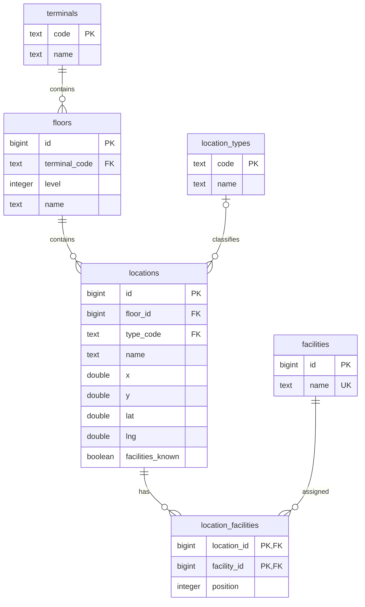

# Schema PostgreSQL



- `floors`: UNIQUE (`terminal_code`, `level`), nên tầng 1 của T1 khác tầng 1 của T2.
- `locations`: chỉ lưu `floor_id`, suy ra nhà ga qua tầng; `type_code` tham chiếu danh mục loại. Các trường liên hệ, mô tả, giờ mở cửa và source_id vẫn thuộc địa điểm.
- `location_facilities`: khóa chính ghép ngăn tiện ích trùng; UNIQUE (`location_id`, `position`) giữ thứ tự API. Xóa địa điểm cascade bảng liên kết; xóa tầng/loại/tiện ích đang dùng bị khóa ngoại chặn.
- `facilities_known` giữ khác biệt giữa danh sách null (chưa cung cấp) và [] (không có tiện ích). Không lưu danh sách tiện ích dưới dạng JSON trong bảng locations.
- Các cột tọa độ vẫn là DOUBLE PRECISION riêng biệt: x/y pixel SVG, lat/lng WGS84. Không tự chuyển đổi khi migration.
- Database mới không có bảng data_imports hoặc flyway_schema_history.

## Khởi tạo và truy cập

`Back-End/database/01_schema.sql` tạo schema chuẩn ngay từ đầu. `02_seed.sql` nạp dữ liệu SQL riêng. Backend không tự tạo bảng hoặc đọc JSON, không dùng Flyway. Chạy mỗi script một lần trên database mới.

API giữ nguyên DTO; DAO JOIN để đọc và ghi địa điểm cùng liên kết trong transaction. Giá trị danh mục mới được đăng ký qua INSERT ON CONFLICT để tương thích CRUD hiện tại; tên mặc định bằng mã. Danh mục chưa có CRUD API riêng. Mặt bằng SVG và đồ thị định tuyến vẫn ở frontend.

Ví dụ truy vấn:

```sql
SELECT l.id, l.name, t.name AS terminal, f.level, lt.name AS type
FROM locations l
JOIN floors f ON f.id = l.floor_id
JOIN terminals t ON t.code = f.terminal_code
LEFT JOIN location_types lt ON lt.code = l.type_code;
```
